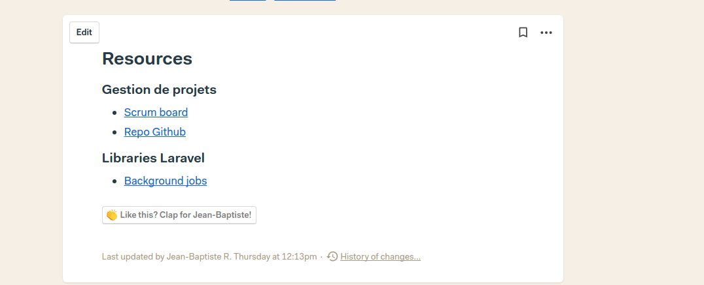

# How we use Basecamp for our projects

This file aim to describe how we sue basecamp to manage our projects, we'll cover the following points :
 - Starting a new project
 - Managing a project

## Starting a new project

Once a new project has been validated by the committee, a Basecamp project is created by the project manager in charge. Each new project is created from the same template. 

The project manager will add members to the Basecamp project and will share a public link allowing everyone who's interested to join the project.

## Managing a project

- In the Campfire, we'll have discussion about the project. We'll avoid using Slack, conversation about a project is always usefull when public.

- In the Message boards, we'll publish important messages. Technical decisions, explanations, etc. The project manager will also post here the Sprint Planning and Sprint Review reports.

- In the To-dos section, we'll post and actualize here the big steps of the project.

- At the moment, the schedule section isn't really used. We'll prefer using Google Calendar but you are free to use it if you feel more comfortable.

- In the Automatic Check-ins section, every developer will post everyday the amount of hours he dedicated for each task. It will be done this way :

Nº'number of the card' - 'Title of the card' +'amount of working hours for one day' ('total of working hours for this task'/'Estimation of working hours for this task' - 'Status (either : finished or in progress')
Example: Nº830 - Vattenfall fixes on websales +3h (3/3) Finished

Any developer can feel free to had comments for more information.

In return, the Project Manager will post a BurnDown chart, aiming at visualizing the progress of the sprint.

- In the Docs & File section, we'll post any documention linked to the project. We'll also reference external resources : a simple bullet list as shown below should do the trick :

### Asynchronous discussion

It's essential to have a way to discuss asynchronously. Basecamp offers a tool to do that called the `Message board`. Here's a non-exhaustive list of what should be put on the message boars :
 - Questions
 - Meetings CR
 - Sprint planning
 - Sprint reviews
 - Announcement
 - ...
