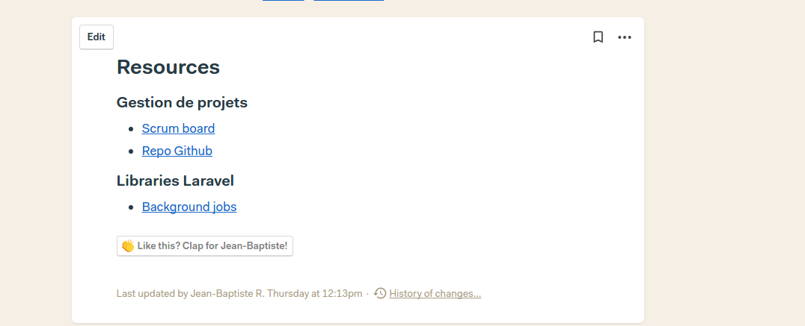

# How we use Basecamp for our projects

This file aim to describe how we sue basecamp to manage our projects, we'll cover the following points :
 - Starting a new project
 - Managing a project

## Starting a new project

## Managing a project

### Asynchronous discussion

It's essential to have a way to discuss asynchronously. Basecamp offers a tool to do that called the `Message board`. Here's a non-exhaustive list of what should be put on the message boars :
 - Questions
 - Meetings CR
 - Sprint planning
 - Sprint reviews
 - Announcement
 - ...

### External resources

For now, we reference external resources that can't be added to the `Doc & files` section in a doc called resources. A simple bullet list as shown below should do the trick :

