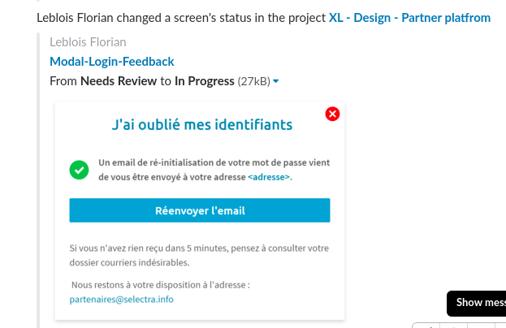

# How we handle the design part of our projects

During the design phase of our projects, we use two tools to allow the designers and the stake holders to communicate : Invision and Slack.

Invision is a great tool to create prototypes and allows the team to give their feedback directly on the screen.

We use slack for any other discussion related to the project, but is not a direct feedback on the prototype.

## Project set up

At the beginning of the project, the team choose one or more reviewers who are responsible for giving feedback. These reviewers **MUST NOT** change mid-project, so it's important to take the time to think about who should be involved in the project.

## Invision

The design phase works in several iterations. At the end of each iteration, the team give some feedback on the prototypes. Then we sort the screens in different categories :

 - **On hold** : Ready to receive feedback ;
 - **In progress** : Feedback ongoing ;
 - **Needs review** : Some changements will be made on the screen during the next iteration ;
 - **Approved** : The screen has been reviewed and approved by the reviewers.

 We use the workflow section of invision to sort the screens, as shown below :

 

 If some string of comments leads to the decision to make a modification, we **MUST** make it a tasks

 

 That way, we can easily track the progress of the project. 

## Slack

At the beginning of the project, we set up Invision to send update directly into the related slack channel. That way everybody knows what's going on, and what they have to do, without even leaving Slack !

